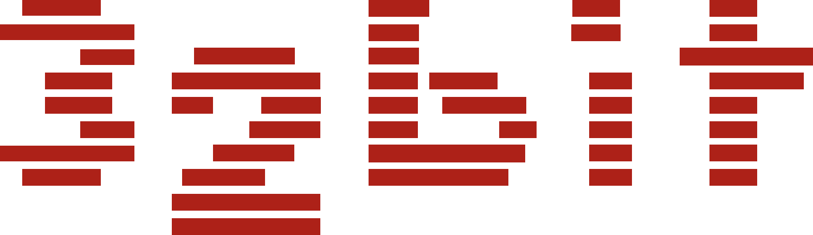
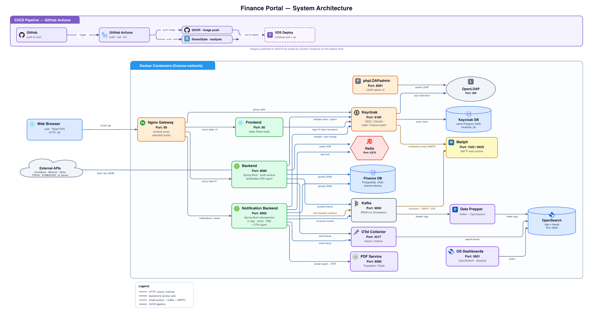
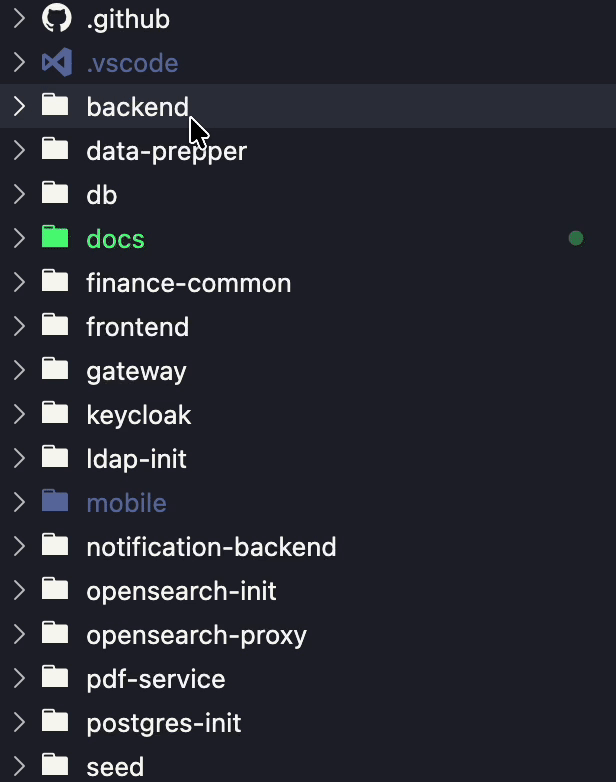
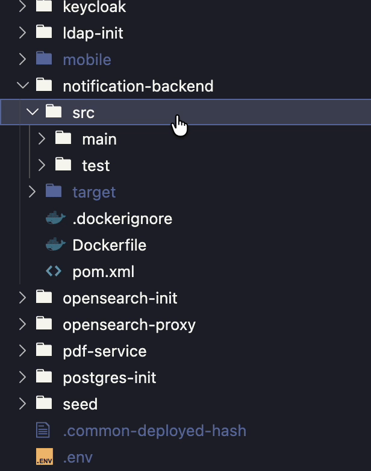
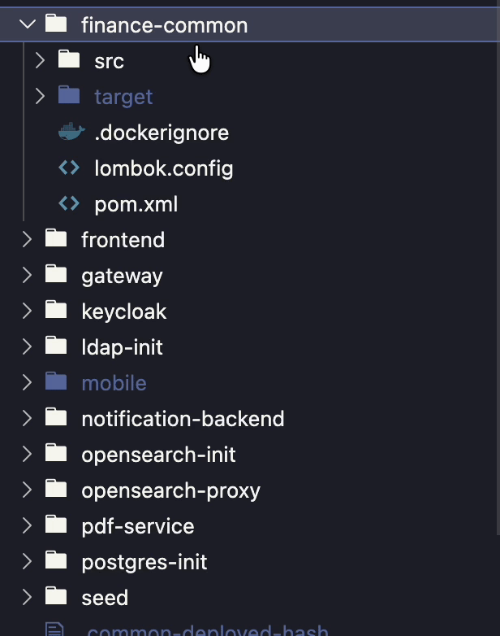
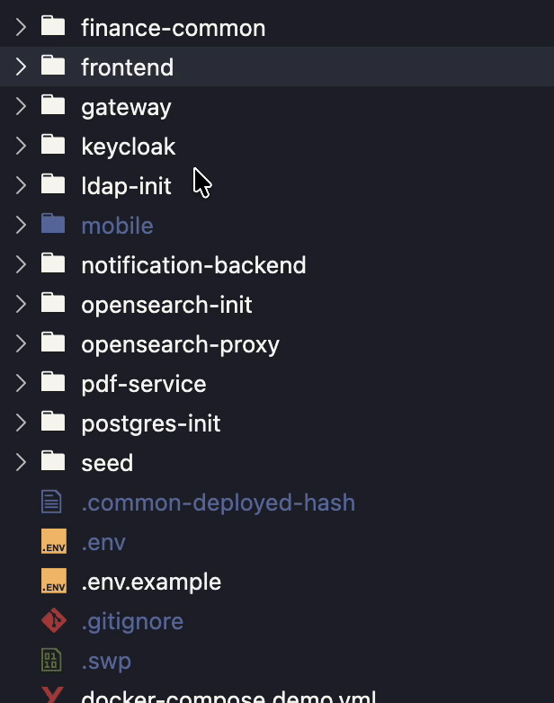

<a id="readme-top"></a>

<div align="center">



<h1>Finance Portal</h1>

<p><b>A full-stack investing dashboard for the Turkish market.</b><br/>
<sub>BIST stocks · Funds · Bonds · FX · Gold · crypto · VIOP — Portfolio, Currency-Correct P&amp;L.</sub></p>

<p>
  <a href="https://finport.dev"></a>
</p>

<p><b>Live at <a href="https://finport.dev">finport.dev</a></b> — production-hosted instance. Inspect the app end-to-end without cloning. Register with any email to try it (the seeded <code>demouser</code> is for the local <code>make demo</code> overlay only, not for prod).</p>

<p></p>

<p><i>Built with the tools and technologies:</i></p>


</div>

<details>
  <summary><b>Table of Contents</b></summary>

- [About the project](#about-the-project)
- [Architecture](#architecture)
- [Services](#services)
- [Documentation](#documentation)
- [Getting started](#getting-started)
  - [Prerequisites](#prerequisites)
  - [Installation](#installation)
- [Usage](#usage)
  - [Logging in](#logging-in)
  - [What's running](#whats-running)
  - [Data sources &amp; API keys](#data-sources--api-keys)
- [Configuration](#configuration)

</details>

## About the project

Finance Portal aggregates the Turkish market — BIST stocks, TEFAS funds, FX, commodities,
bonds & bills, crypto and VIOP derivatives — behind a single dashboard, and lets you model a
portfolio of hypothetical lots with realized/unrealized P&L, allocation and performance over time.

Why it exists: tracking a multi-asset Turkish portfolio means juggling several apps, none of
which convert everything to a single currency at the right historical rate. This does — every
candle is converted at its own day's rate, so P&L and comparisons stay honest across TRY/USD/EUR.

Highlights:

- **Unified market data** — multi-year candle history across every asset class, with per-day
  currency conversion (TRY / USD / EUR) and one universal search across assets and macro indicators.
- **Pro charting workbench** — Lightweight Charts with SMA / EMA / RSI / MACD and volume
  sub-panels, drawing tools (trend, line, freehand, text, emoji), Fibonacci, magnet snap,
  multi-asset compare and fullscreen.
- **Hypothetical-lot portfolio** — multiple named portfolios of open/closed positions — including
  VIOP derivatives with LONG / SHORT, direction-aware P&L — with realized & unrealized P&L in TRY,
  an allocation donut, a performance curve and daily snapshots.
- **Analytics** — multi-asset comparison framed in any currency, benchmarked against Turkish
  macro indicators: CPI inflation (TÜFE), the TLREF and CBRT policy rate, and TRY/USD/EUR deposit
  rates. Plus scenario simulation ("what if I'd put X into Y on date Z"), an inflation-beater
  ranking against an inflation / rate / deposit benchmark, and an asset-returns ranking (every
  spot asset's realized TRY return per 1W…5Y window, with annualized volatility and a
  low/medium/high risk band).
- **Customizable overview** — a drag-and-drop, multi-page widget board (create, rename and delete
  your own pages, persisted per user) surfacing movers per asset class, bank buy/sell rates, macro
  indicators and the returns ranking.
- **Watchlists & price alerts** — group instruments into named watchlists and set price- or
  percent-change alerts delivered in-app and by email.
- **Financial news** — a categorized Turkish-market feed (BIST, companies, crypto, FX, commodities,
  bonds, general) with full-text search.
- **Notifications & email** — themed PDF portfolio reports plus a real-time notification center:
  an in-app bell over SSE and email for price-alert / watchlist thresholds, news and portfolio
  moves, with granular per-type, per-channel preferences. Mail is decoupled through a Kafka-relayed
  **outbox**, so a slow SMTP server never blocks a request, and in the demo every message is
  captured in **Mailpit**.
- **Admin console** — manage tracked assets and news sources, ban / unban users, broadcast notices
  and trigger data-sync jobs from a live SSE task panel.
- **Auth & profile** — Keycloak with OIDC / JWT, an LDAP user federation, role-based access,
  self-service TOTP 2FA, OTP-verified email change and a per-user display-currency preference.
- **Bilingual UI & theming** — TR / EN per user, a light / dark theme across the app, charts and
  PDF reports, and a first-run guided tour.
- **Observability** — structured logs, traces and metrics flow through OpenTelemetry into
  OpenSearch (read in OpenSearch Dashboards).

<p align="right">(<a href="#readme-top">back to top</a>)</p>

## Architecture

<p align="center"></p>
<p align="center"><sub><i>Click the diagram to view it full size.</i></sub></p>

- **Flyway** owns the schema and config rows (instruments, tracked assets, …) with fixed IDs.
- The **seed** (`seed/`, demo mode only) adds *data only* — candles, prices, the sample portfolio
  — so it never conflicts with the migrator.
- Mail uses **Mailpit** locally; a real SMTP provider is a production concern handled separately.
- **`finance-common`** is a shared Java library (published to GitHub Packages) that every backend
  module depends on — the `ApiResponse` envelope and shared DTOs, JWT/security plumbing, Redis
  caching, i18n, the tiered rate-limit filter, exception handling and the Kafka event contracts —
  so cross-cutting concerns are defined once instead of copied per service.

<p align="right">(<a href="#readme-top">back to top</a>)</p>

## Services

A quick tour of what each container is responsible for:

**Nginx Gateway** (`:80` / `:443`) is the only thing the browser talks to — the edge proxy. It
forwards the SPA routes to the **Frontend** container, `/api/v1` to whichever backend owns the route,
`/auth` to Keycloak, and applies the edge rate-limit zones.

**Frontend** is the built React / Vite single-page app, served by its own lightweight Nginx and
reachable only through the gateway.

**Backend** (`:8080`) is the core Spring Boot app, split into Maven modules (market, portfolio,
user, news) that all build on the shared **`finance-common`** library (DTOs, security, caching,
i18n and Kafka event contracts — see [Architecture](#architecture)). It fetches market data from
the upstream providers on a daily schedule, writes it to Postgres, caches hot reads in Redis,
serves the dashboard/portfolio/analytics APIs, and publishes domain events to Kafka.

**Notification Backend** (`:8082`) is a separate Spring Boot service for the real-time side:
in-app notifications, price alerts, watchlists and the SSE stream — built on the same
**`finance-common`** library. It consumes the backend's Kafka events, resolves users through
Keycloak, and sends mail through an outbox that relays via Kafka to SMTP.

**PDF Service** is a small Node/Puppeteer worker that turns a portfolio report into a PDF on demand.

**Keycloak** (`:8180`) handles identity — OIDC/JWT for both backends — with its users federated
from **OpenLDAP**; **phpLDAPadmin** is just the LDAP admin UI.

**Kafka** (KRaft, no Zookeeper) is the event bus the two backends communicate over. **Redis** is the
shared cache (market snapshots, the overview's movers) and also holds the Bucket4j rate-limit
buckets. **PostgreSQL** is one instance with two databases — the app and Keycloak — and Flyway owns
the schema. A one-shot **db-migrator** (Flyway) applies the SQL migrations against it before the
backends start.

**Observability**: an OpenTelemetry agent in each backend ships traces **and** metrics to the **OTel
Collector**, which sends traces straight to **OpenSearch** and routes metrics through **Data Prepper**
(Micrometer OTLP → collector → Data Prepper → OpenSearch); application logs travel Kafka → **Data
Prepper** → **OpenSearch**. You read all three in OpenSearch Dashboards. A one-shot **opensearch-init**
bootstraps the index templates and dashboards after OpenSearch is up. **Mailpit** is the dev SMTP
catcher — outgoing mail lands in its inbox instead of a real provider.

**SonarQube** (the `sonarqube` scanner plus its own `sonar-db` Postgres) is the self-hosted
code-quality server. It sits behind a Compose `profiles:` flag, so it starts only when explicitly
enabled — it is not part of the default stack.

<p align="right">(<a href="#readme-top">back to top</a>)</p>

## Documentation

- **Interactive API** — Swagger UI (needs the stack running): <http://localhost/swagger-ui/index.html>
- **OpenAPI spec** — [`docs/documentation/openapi.json`](docs/documentation/openapi.json)

Reference documents (PDF):

| Document | What's inside |
|----------|---------------|
| [API Reference](docs/documentation/api.pdf) | versioning (`/api/v1`), auth, the `ApiResponse` envelope, endpoint map |
| [Error Handling](docs/documentation/error-handling.pdf) | the error shape and which error code arises in which situation |
| [Testing](docs/documentation/testing.pdf) | unit-test conventions (AAA), coverage targets, how to run |
| [Architecture & Principles](docs/documentation/principles.pdf) | SOLID, layered architecture, patterns, resilience & caching |
| [CI / CD](docs/documentation/ci-cd.pdf) | how CI tests + builds images on every push, how CD auto-deploys, required secrets, manual / rollback ops |

<p align="right">(<a href="#readme-top">back to top</a>)</p>

## Getting started

### Prerequisites

- Docker with the Compose plugin (Docker Desktop, or Docker Engine + `docker compose`)
- ~8 GB free RAM and ~3 GB disk
- Ports `80`, `8180`, `8025`, `5601` free on localhost

No JDK / Node / Maven needed locally — images build from source inside Docker, and **no GitHub
token is required**.

### Installation

```bash
git clone https://github.com/umutozturk34/Toyota_32Bit_Finance_Portal.git
cd Toyota_32Bit_Finance_Portal
make demo      # seeded demo data + demo user (recommended)
```

`make demo` creates `.env` from the template, builds the images, and seeds ~4 years of market
data plus a sample portfolio (first run takes a few minutes). When it settles, open
**http://localhost**.

```bash
make empty     # clean database (no seed, no demo user)
make reset     # stop and WIPE all data (start over / switch modes)
make down      # stop (keeps data)
make help      # show all targets with one-line descriptions
```

<details>
<summary>No <code>make</code>? Use Docker Compose directly</summary>

```bash
cp .env.example .env
docker compose -f docker-compose.yml -f docker-compose.demo.yml up -d --build   # demo
docker compose up -d --build                                                     # empty
```
</details>

Both modes share the same `.env` (ships with working defaults). The mode is only which compose
file(s) you run — `docker-compose.demo.yml` adds the seed and the demo user.

**Running empty mode.** Prefer a clean start where the app fetches its own data? Run `make empty`
(it also creates `.env` from the template on first run, exactly like `make demo`). On the **first
boot the backend pulls years of history from the upstreams** in dependency order (FX → stocks →
commodities), which can take **~20–30 minutes** (sometimes longer) depending on rate limits.

> **Empty mode requires an `EVDS_API_KEY`** (free — see [Data sources](#data-sources--api-keys) for
> where to get it). EVDS is the source for FX, macro indicators and bonds, and because stocks and
> commodities are converted through FX, a clean database with no EVDS key **fails to populate**.
> `COINGECKO_KEY` is optional (blank falls back to CoinGecko's rate-limited public tier). In **demo
> mode both keys are optional** — the data is already seeded.

The fetch is idempotent: it only runs for asset classes whose tables are still empty. To skip it and
fill the database yourself, set `APP_MARKET_INIT_ENABLED=false` in `.env`; the cold-start fetcher
lives in [`MarketDataInitializer.java`](backend/finance-app/src/main/java/com/finance/app/config/MarketDataInitializer.java).

**For those who want to deploy it (server + real mail).** To self-host on a VDS with a real mail provider: set the
`SPRING_MAIL_*` variables in `.env` (host, port, username, password, auth, STARTTLS) — the same vars
drive **both** the app's mail and Keycloak's account emails (verify / 2FA / reset) — and run with the
production overlay, which drops the dev Mailpit catcher:

```bash
docker compose -f docker-compose.yml -f docker-compose.prod.yml up -d
```

<details>
<summary><b>Full VDS deployment + CI/CD</b></summary>

The live instance at [finport.dev](https://finport.dev) runs on this exact stack:

| Layer | Provider we use | What it does | Cost |
|---|---|---|---|
| **Compute (VDS)** | [**Contabo**](https://contabo.com) Cloud VPS — Ubuntu 24.04, ~16 GB RAM, x86 | Hosts every Docker container (backend, notification, frontend, Postgres, Keycloak, Kafka, OpenSearch, Redis, …) | ~$9–25/month |
| **Domain + DNS + HTTPS** | [**Cloudflare**](https://cloudflare.com) — registrar + DNS + proxy | DNS records (A/CNAME/TXT for SPF, DKIM, DMARC); free TLS termination at the edge; DDoS protection; CDN cache | ~$10/year (domain only) |
| **Outbound mail (SMTP relay)** | [**Brevo**](https://brevo.com) — free tier 300/day | Receives mail from the notification service over SMTP, DKIM-signs it for `finport.dev`, hands off to Gmail/Outlook MX servers with managed IP reputation | $0 |
| **Image registry** | **GitHub Container Registry (GHCR)** | CI pushes versioned images here; the VDS pulls without registry login (images are public) | $0 |

A different stack works just as well — these are the lowest-friction defaults that match the
docs. Swap Contabo for Hetzner, Cloudflare for Namecheap+Let's Encrypt, Brevo for Resend / SES,
nothing in the code changes. See [`docs/documentation/ci-cd.pdf`](docs/documentation/ci-cd.pdf)
for the full one-hour walkthrough.

**1. Server.** A Linux VDS with Docker + the Compose plugin, ~16 GB RAM (OpenSearch, Kafka, Keycloak
and two JVM backends are memory-hungry), ports `80`/`443` open. Use an **x86/amd64** host so the
prebuilt GHCR images run as-is.

**2. Get the files + set credentials.** Clone the repo on the server — you build nothing there, it
only needs the compose files and the mounted config (`keycloak/`, `gateway/`, `data-prepper/`,
`db/migration/`, …). Create a production `.env` with real secrets and `SPRING_MAIL_*` for your
provider:

```bash
git clone https://github.com/umutozturk34/Toyota_32Bit_Finance_Portal.git
cd Toyota_32Bit_Finance_Portal
cp .env.example .env   # edit: strong DB/Redis/Keycloak passwords, EVDS key, SMTP, real domain
```

**3. Pull images + run (no Mailpit).** CI builds and pushes the images to GHCR; the server only pulls
them. The images are public, so no registry login is needed:

```bash
docker compose -f docker-compose.yml -f docker-compose.prod.yml pull
docker compose -f docker-compose.yml -f docker-compose.prod.yml up -d
```

**4. Domain + HTTPS.** Point a domain at the server and terminate TLS (the gateway, Caddy, a reverse
proxy, or Cloudflare). Put the real URLs in `.env` (`FRONTEND_BASE_URL`, `VITE_KEYCLOAK_URL`) and
Keycloak's hostname.

**5. Automated deploys (CD).** [`.github/workflows/deploy.yml`](.github/workflows/deploy.yml) rolls the
stack forward after CI passes on `main` (SSH → `git pull` → `compose pull` → `up -d`). Add these repo
secrets: `VDS_HOST`, `VDS_USER`, `VDS_SSH_KEY`, `VDS_APP_DIR`. No registry token needed — the GHCR
images are public.

First boot runs the Flyway migrations and imports the Keycloak realm automatically; mail goes straight
to your SMTP provider (the prod overlay excludes Mailpit).
</details>

<p align="right">(<a href="#readme-top">back to top</a>)</p>

## Usage

### Logging in

Login runs through Keycloak. Demo credentials (in `.env`, intentionally visible — change for prod):

| User | Password | Notes |
|------|----------|-------|
| `admin` | `Admin123!` | admin + user roles (both modes) |
| `demouser` | `Demo123!` | demo mode only — owns the sample portfolio |

### What's running

| URL | Service |
|-----|---------|
| http://localhost | Main app (Nginx gateway → frontend + API + `/auth` Keycloak) |
| http://localhost/swagger-ui/index.html | Swagger UI — main backend (`:8080`) interactive API |
| http://localhost:8082/swagger-ui/index.html | Swagger UI — notification backend (`:8082`) interactive API |
| http://localhost:8180/auth | Keycloak admin console (same Keycloak, direct port) |
| http://localhost:8025 | Mailpit — all outgoing mail is captured here |
| http://localhost:8081 | phpLDAPadmin — directory entries (login: `cn=admin,dc=finance,dc=com`) |
| http://localhost:5601 | OpenSearch Dashboards (logs / traces) |
| `localhost:5432` | PostgreSQL — connect with any DB client (creds in `.env`) |
| `localhost:6379` | Redis — cache + rate-limit buckets |
| http://localhost:9200 | OpenSearch — log / trace store API |

> On a VDS deploy these ports stay bound to `127.0.0.1` (security — the public internet only
> reaches `:80` / `:443` through Nginx). To open OpenSearch Dashboards / phpLDAPadmin /
> Mailpit / Keycloak admin from your laptop, run an SSH tunnel:
>
> ```bash
> ssh -L 5601:127.0.0.1:5601 -L 8081:127.0.0.1:8081 -L 8025:127.0.0.1:8025 \
>     -L 8180:127.0.0.1:8180 -L 8082:127.0.0.1:8082 root@<VDS_IP>
> ```
> Keep the SSH session open, then visit the same `http://localhost:<port>` URLs above.

> Tip: set a watchlist price threshold or enable 2FA, then watch the email land in **Mailpit**
> (`:8025`) — the demo captures all outgoing mail there, no real SMTP needed.

### Data sources & API keys

The demo ships with seeded history, so it works out of the box. The schedulers refresh the data on
a **daily** cadence (it is not a live tick feed). To enable those refreshes — and to populate an
empty-mode database — add free keys to `.env`:

- **`EVDS_API_KEY`** — TCMB EVDS (FX, macro indicators, bonds & bills). **Required for empty mode**
  (the demo already ships this data). Free: register at <https://evds2.tcmb.gov.tr> → Profile → API Key.
- **`COINGECKO_KEY`** — crypto (optional in both modes; blank = public rate-limited tier).

Those are the **only two** that take a key. Yahoo Finance, TEFAS, döviz.com, İş Yatırım and the
RSS feeds are all keyless.

> **Heads-up for demo users:** the seed is a point-in-time snapshot, so after a while some prices
> and figures will look dated — that's expected, the demo doesn't refresh on its own. To pull fresh
> numbers on demand, log in as `admin` and open **Admin → Tasks** (the Task Manager) and trigger a
> refresh for any market. With the keys above set, the daily schedulers also keep it current.

<!-- Admin to Tasks demo GIF: save the recording as docs/imagesandgifs/admin-tasks.gif, then uncomment the line below. -->
<!-- <p align="center"></p> -->

> **Refresh order matters on an empty DB.** Commodities are quoted in USD upstream but stored in TRY,
> so they are converted with the FX rate. When you refresh by hand (Admin → Tasks), fetch **FX /
> currencies before commodities** — otherwise commodity values come out missing or wrong because the
> converting rate isn't there yet. The automatic cold-start fetch already orders this for you
> (FX → stocks → commodities).

Where each dataset comes from:

| Dataset | Source |
|---------|--------|
| FX / currencies · macro indicators · bonds & bills | TCMB **EVDS** |
| Bank / exchange rates | **döviz.com** |
| Stock listing (universe) | **İş Yatırım** |
| Stock prices (per symbol) | **Yahoo Finance** |
| Commodities / precious metals | **Yahoo Finance** |
| Funds | **TEFAS** |
| Crypto | **CoinGecko** + **Binance** |
| VIOP / derivatives | **İş Yatırım** |
| News | **Turkish RSS feeds** |

<p align="right">(<a href="#readme-top">back to top</a>)</p>

## Configuration

Most behaviour is env-driven through the root `.env`; everything else lives in a predictable
place per service. Each GIF below walks to a location; the path is printed under it.

<table>
<tr>
<td width="50%" align="center">
<b>Main backend</b> (market / portfolio / user / news)<br/>
<br/>
<sub><code>backend/finance-app/src/main/resources/</code></sub>
</td>
<td width="50%" align="center">
<b>Notification backend</b><br/>
<br/>
<sub><code>notification-backend/src/main/resources/</code></sub>
</td>
</tr>
<tr>
<td width="50%" align="center">
<b>Backend i18n</b> — error / notification bundles<br/>
<br/>
<sub><code>backend/*/src/main/resources/i18n/</code> · <code>notification-backend/src/main/resources/i18n/</code></sub>
</td>
<td width="50%" align="center">
<b>Frontend i18n</b> — UI translations (TR / EN)<br/>
<br/>
<sub><code>frontend/src/shared/i18n/tr.json</code> · <code>frontend/src/shared/i18n/en.json</code></sub>
</td>
</tr>
</table>

**Infra / edge** — root `.env`, `docker-compose.yml`, `gateway/`, `keycloak/`, `data-prepper/`, `otel-config.yaml`

<p align="right">(<a href="#readme-top">back to top</a>)</p>
